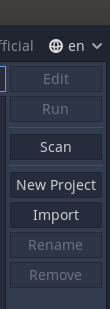

# Minicurso de Godot da XIX Semana da IBM
Minicurso sobre criação de games com a Engine Godot ministrado durante a Semana da IBM 2021

- Link para os assets usados neste projeto :
  - https://pixelfrog-assets.itch.io/treasure-hunters

## Para importar o projeto siga os seguintes passos:

1. Baixe o projeto em formato zip:

2. Descompacte o arquivo zip
3. Importe o projeto no godot clicando no botão para importação a direita da tela inicial:

4. Selecione o arquivo 'project.godot' da pasta gerada do projeto e pronto!
